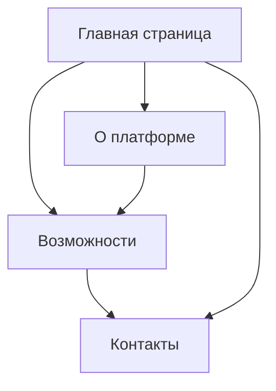

## 1. Обзор продукта

Сайт платформы, который представляет собой информационный ресурс, рассказывающий о возможностях и преимуществах платформы. Основная цель - привлечение новых пользователей и партнеров через понятное объяснение ценности продукта.

Целевая аудитория: потенциальные клиенты, партнеры, инвесторы и пользователи, интересующиеся решениями платформы.

## 2. Основные функции

### 2.1 Целевые роли пользователей

| Роль | Способ взаимодействия | Основные интересы |
|------|----------------------|-------------------|
| Потенциальный клиент | Просмотр сайта | Понимание преимуществ и возможностей |
| Партнер | Изучение условий сотрудничества | Информация о партнерской программе |
| Инвестор | Анализ информации | Данные о компании и перспективах |
| Текущий пользователь | Доступ к поддержке | Инструкции и помощь |

### 2.2 Структура страниц

Основные страницы сайта платформы:
1. **Главная страница**: герой-секция, краткое описание платформы, основные преимущества.
2. **О платформе**: детальное описание, технологии, команда.
3. **Возможности**: функциональность, кейсы использования, тарифы.
4. **Контакты**: форма обратной связи, реквизиты, карта.

### 2.3 Детализация страниц

| Страница | Модуль | Описание функции |
|----------|--------|------------------|
| Главная | Герой-секция | Привлекающий заголовок, подзаголовок, призыв к действию |
| Главная | Преимущества | Карточки с ключевыми преимуществами платформы |
| Главная | Отзывы | Блок с отзывами клиентов или кейсами |
| О платформе | Описание | Расширенное описание миссии и целей |
| О платформе | Технологии | Перечень используемых технологий |
| О платформе | Команда | Фото и описание ключевых членов команды |
| Возможности | Функциональность | Детальный перечень возможностей платформы |
| Возможности | Тарифы | Таблица с тарифными планами |
| Контакты | Форма обратной связи | Поля для имени, email, сообщения |
| Контакты | Контактная информация | Адрес, телефон, email |

## 3. Основные процессы

Пользовательский путь на сайте:
1. Посещение главной страницы
2. Ознакомление с преимуществами
3. Переход на страницу "О платформе" для детального изучения
4. Изучение возможностей и тарифов
5. Обращение через форму контактов

## 4. Дизайн интерфейса

### 4.1 Стиль дизайна
- **Цветовая палитра**: современные приглушенные цвета, основной - синий или зеленый для доверия
- **Стиль кнопок**: скругленные, с тенью при наведении
- **Типографика**: современный sans-serif шрифт, размеры 16px для основного текста
- **Макет**: карточная система с отступами, фиксированная ширина контента
- **Иконки**: минималистичные линейные иконки

### 4.2 Описание дизайна страниц

| Страница | Модуль | Элементы дизайна |
|----------|--------|------------------|
| Главная | Герой-секция | Полноэкранный заголовок, контрастный фон, крупный призыв к действию |
| Главная | Преимущества | Сетка из 3-4 карточек с иконками, анимация при прокрутке |
| О платформе | Описание | Текст в две колонки, фотографии команды в круглой форме |
| Возможности | Тарифы | Таблица сравнения, выделение популярного тарифа |
| Контакты | Форма | Простые поля ввода, кнопка отправки с индикатором загрузки |

### 4.3 Адаптивность
- Десктоп-first подход
- Адаптация под планшеты (768px) и мобильные устройства (375px)
- Оптимизация навигации для мобильных: гамбургер-меню
- Крупные кнопки для тач-взаимодействия

### 4.4 SEO и контент
- Мета-теги для каждой страницы
- Структурированные данные (JSON-LD)
- Оптимизированные изображения с alt-текстами
- Чистые URL-адреса
- XML-карта сайта