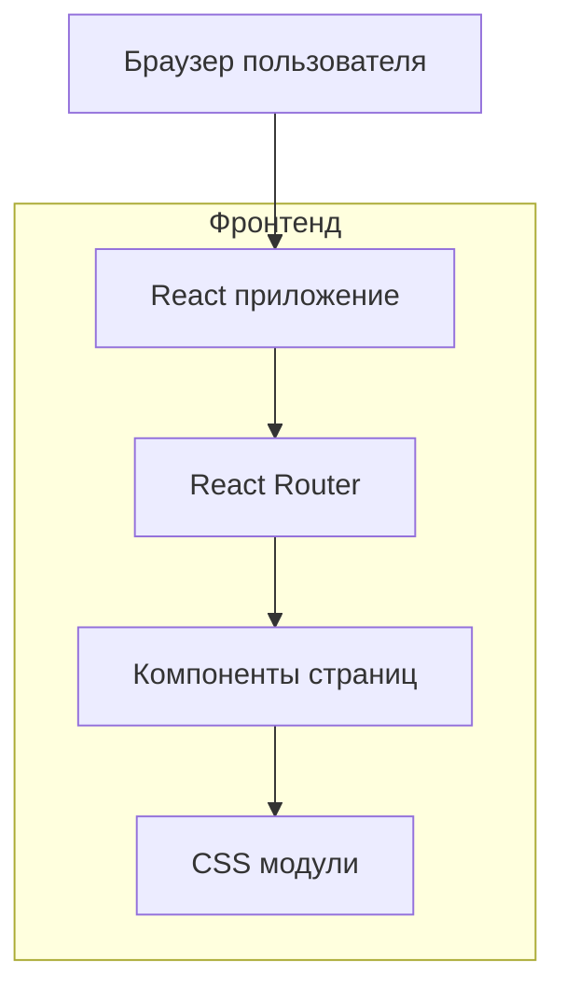

## 1. Архитектурное решение



## 2. Описание технологий

- **Фронтенд**: React@18 + Vite + Tailwind CSS
- **Инструмент инициализации**: vite-init
- **Бэкенд**: Отсутствует (статический сайт)
- **Деплой**: GitHub Pages или Netlify

## 3. Определение маршрутов

| Маршрут | Назначение |
|---------|------------|
| / | Главная страница с преимуществами |
| /about | Страница "О платформе" |
| /features | Страница с возможностями и тарифами |
| /contact | Страница контактов с формой |

## 4. Структура компонентов

### 4.1 Основные компоненты

```typescript
// Типы данных для компонентов
interface NavigationItem {
  name: string;
  href: string;
}

interface AdvantageCard {
  title: string;
  description: string;
  icon: string;
}

interface TeamMember {
  name: string;
  role: string;
  photo: string;
}

interface PricingPlan {
  name: string;
  price: string;
  features: string[];
  popular?: boolean;
}
```

### 4.2 Компоненты страниц

- `Layout` - основной макет с навигацией и футером
- `HeroSection` - герой-секция для главной страницы
- `AdvantagesGrid` - сетка преимуществ
- `TeamSection` - секция команды
- `PricingTable` - таблица тарифов
- `ContactForm` - форма обратной связи

## 5. Архитектура данных

### 5.1 Контентные данные

Данные хранятся в виде JSON файлов в директории `src/data/`:

```typescript
// navigation.json
{
  "items": [
    { "name": "Главная", "href": "/" },
    { "name": "О платформе", "href": "/about" },
    { "name": "Возможности", "href": "/features" },
    { "name": "Контакты", "href": "/contact" }
  ]
}

// advantages.json
{
  "cards": [
    {
      "title": "Быстрый старт",
      "description": "Начните работу за минуты благодаря простому интерфейсу",
      "icon": "rocket"
    }
  ]
}
```

### 5.2 Статические ресурсы

- Изображения: `src/assets/images/`
- Иконки: `src/assets/icons/`
- Шрифты: `src/assets/fonts/`

## 6. Стилизация

### 6.1 Tailwind CSS конфигурация

```javascript
// tailwind.config.js
module.exports = {
  content: ["./src/**/*.{js,jsx,ts,tsx}"],
  theme: {
    extend: {
      colors: {
        primary: {
          50: '#e3f2fd',
          500: '#2196f3',
          600: '#1976d2',
          700: '#1565c0'
        }
      },
      fontFamily: {
        sans: ['Inter', 'system-ui', 'sans-serif']
      }
    }
  }
}
```

### 6.2 CSS переменные

```css
/* src/styles/variables.css */
:root {
  --color-primary: #2196f3;
  --color-secondary: #424242;
  --border-radius: 8px;
  --transition-speed: 0.3s;
}
```

## 7. SEO и мета-теги

### 7.1 React Helmet для управления мета-тегами

```typescript
// Пример использования
import { Helmet } from 'react-helmet-async';

function HomePage() {
  return (
    <>
      <Helmet>
        <title>Платформа - Решение для вашего бизнеса</title>
        <meta name="description" content="Инновационная платформа для автоматизации бизнес-процессов" />
        <meta property="og:title" content="Платформа" />
        <meta property="og:description" content="Инновационная платформа для автоматизации" />
      </Helmet>
      {/* Контент страницы */}
    </>
  );
}
```

## 8. Производительность

### 8.1 Оптимизации

- Ленивая загрузка изображений через `loading="lazy"`
- Код-сплиттинг с React.lazy для больших компонентов
- Оптимизация шрифтов через `font-display: swap`
- Минификация CSS и JavaScript при сборке

### 8.2 Метрики Core Web Vitals

- LCP (Largest Contentful Paint) < 2.5s
- FID (First Input Delay) < 100ms
- CLS (Cumulative Layout Shift) < 0.1

## 9. Деплой и CI/CD

### 9.1 GitHub Actions workflow

```yaml
name: Deploy to GitHub Pages
on:
  push:
    branches: [ main ]
jobs:
  deploy:
    runs-on: ubuntu-latest
    steps:
      - uses: actions/checkout@v3
      - uses: actions/setup-node@v3
        with:
          node-version: 18
      - run: npm ci
      - run: npm run build
      - run: npm run deploy
```

### 9.2 Конфигурация деплоя

- Базовый URL: настраивается через `base` в vite.config.js
- Ассеты: оптимизированные и с хэшированными именами
- Service Worker: опционально для офлайн-работы